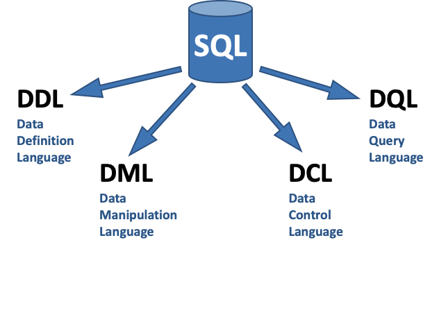

# SQL-Cheatsheet
Welcome to the SQL Cheatsheet repository! <br>
This cheatsheet is a comprehensive collection of commonly-used SQL queries and commands, organized by topic (e.g. DDL, DML, etc.). Our goal is to make it easy for developers, data analysts, and database administrators to quickly find and use the SQL commands they need.

To contribute to the cheatsheet, please follow these guidelines:
- Make sure your contributions align with the theme and scope of the cheatsheet.
- You can submit a pull request with your changes. Please make sure that your pull request follows the same formatting and style as the rest of the cheatsheet.
- The pull request will be reviewed by the maintainers of the repository, who will check if the changes align with the scope of the cheatsheet and that it is formatted correctly.
- Once the pull request is approved, it will be merged into the cheatsheet.

Thank you for your contributions to this community-driven project!

#### **- Use ***CTRL+F*** to search for something in the cheatsheet!**
#### **- Find the ***TO-DO list*** of the cheatsheet [here](to-do.md).**
<br>

# Table of Content
* [SQL Cheatsheet](#sql-cheatsheet)
- [About SQL](#about-sql)
- [Data Definition Language](#data-definition-language)
- [Data Manipulation Language](#data-manipulation-language)
- [Data Query Language](#data-query-language)
- [Views](#views)
- [Data Security](#data-security)
- [Data Backup](#data-backup)
- [Other](#other)
* [Project](#other)
<br>

# About SQL 
Structured Query Language (SQL) refers to a standard programming language utilized to extract, organize, manage, and manipulate data stored in relational databases. SQL is thereby referred to as a database language that can execute activities on databases that consist of tables made up of rows and columns.
### Main Features
- SQL is a declarative, set- and table-oriented language
- SQL lacks features of a programming language
- No undo feature!
- Not case-sensitive
- Recommendation: use uppercase for keywords, lowercase for table and column names
- Arbitrary use of spaces, line breaks, and tabs is allowed.

### Language Areas
SQL is the standard language and interface for:
- Defining (DDL)
- Managing access (DCL)
- Manipulating (DML)
- Querying (DQL) relational databases.



([Back to top](#sql-cheatsheet))
# Data-Definition-Language
> DDL is a subset of SQL (Structured Query Language) that is used to define the structure of a relational database. DDL statements are used to create, modify, and delete database objects such as tables, views, indexes, and constraints.
### CREATE
The CREATE command is used to create a new table with specified columns and data types. The table name, column names, and data types must be defined within the command.
> This command is used to create a new table with specified columns and data types
```sql       
    CREATE TABLE table_name (
    column1 data_type constraint,
    column2 data_type constraint,
    );
```
### ALTER
The ALTER command is used to make changes to an existing table, such as adding a new column, modifying an existing column, or deleting a column.
> This command is used to add a new column to an existing table
```sql
    ALTER TABLE table_name
    ADD column_name data_type constraint;
```
> This command is used to modify an existing column in a table
```sql
    ALTER TABLE table_name
    MODIFY column_name data_type constraint;
```

> This command is used to delete a column from an existing table
```sql
    ALTER TABLE table_name
    DROP COLUMN column_name;
```
### DROP
The DROP command is used to delete an existing table, its structure, and all its data permanently from the database. It can also be used to delete other database objects such as views, indexes, and sequences. Once a table is dropped, all the data stored in it will be lost and cannot be recovered. It is important to use this command with caution as it cannot be undone.
> This command is used to delete an existing table and all its data
```sql
    DROP TABLE table_name;
```
### TRUNCATE
The TRUNCATE command is used to delete all data from an existing table, but it keeps the table structure and its associated objects such as indexes, triggers, and constraints. Unlike the DROP command, TRUNCATE does not generate any undo logs, making it faster and more efficient for large tables with many rows. However, it also does not fire any DELETE triggers, and the data deleted cannot be recovered. It is important to use this command with caution as it cannot be undone.
> This command is used to delete all data from an existing table, but keeps the table structure
```sql
    TRUNCATE TABLE table_name;
```
### SQL KEYS
In SQL, keys are used to establish and enforce relationships between tables in a database. There are two main types of keys: primary keys and foreign keys.
**Primary Key**
A primary key is a unique identifier for each row in a table. It is used to enforce the integrity of the data and to ensure that there are no duplicate values in the table. Only one primary key can be defined for a table, and it cannot contain null values. The primary key is defined using the PRIMARY KEY constraint.
> This command is used to specify a column or set of columns as the primary key for a table
```sql
    PRIMARY KEY (column1, column2, ...)
```
**Foreign Key**
A foreign key is a column or set of columns in a table that is used to establish a link between the data in two tables. The foreign key references a primary key in another table, creating a link between the two tables. This link is used to enforce referential integrity, which ensures that data in the related tables is consistent and that there are no orphaned records. The foreign key is defined using the FOREIGN KEY constraint.
> This command is used to specify a foreign key constraint on a column in a table
```sql
    FOREIGN KEY (column) REFERENCES referenced_table(referenced_column)
```
In summary, primary keys are used to uniquely identify each record in a table and foreign keys are used to create links between tables, ensuring data integrity and consistency.

([Back to top](#sql-cheatsheet))
# Data-Manipulation-Language
> DML is a computer programming language used to retrieve, manipulate, and update data in a relational database. Examples of DML statements include SELECT, INSERT, UPDATE, and DELETE. These statements allow users to query the database for specific information, add new data to the database, change existing data, and delete unwanted data. DML is typically used in conjunction with Data Definition Language (DDL) statements, which are used to create and modify the structure of a database, such as creating tables and establishing relationships between them.
### INSERT
The INSERT statement is used to insert new data into a table in the database. It allows the user to specify the columns and values of the new data being inserted.
> This command is used to insert new data into a table
```sql
    INSERT INTO table_name (column1, column2, ...)
    VALUES (value1, value2, ...);
```
### UPDATE
The UPDATE statement is used to modify existing data in a table. It allows the user to specify which columns and values to update and the condition to select which rows to update.
> This command is used to update existing data in a table
```sql
    UPDATE table_name
    SET column1 = value1, column2 = value2, ...
    WHERE some_column = some_value;
```
### DELETE
The DELETE statement is used to delete data from a table. It allows the user to specify the condition to select which rows to delete.
> This command is used to delete data from a table
```sql
    DELETE FROM table_name
    WHERE some_column = some_value;
```
### CASCADING
The CASCADE option is used to specify that when a referenced row in a parent table is deleted, all corresponding rows in a child table will also be deleted.
> This command is used to specify that when a referenced row in a parent table is deleted, all corresponding rows in a child table will also be deleted
```sql
    CREATE TABLE table1 (
        id INT PRIM
    );
```
### MERGE
The MERGE statement is used to either update or insert data into a table based on a condition. It allows the user to specify a source table, the conditions for updating and inserting and the columns and values to be used.
> This command is used to either update or insert data into a table based on a condition
```sql
    MERGE INTO table_name
    USING (SELECT column1, column2, ... FROM source_table) source
    ON (table_name.id = source.id)
    WHEN MATCHED THEN UPDATE SET column1 = source.column1, ...
    WHEN NOT MATCHED THEN INSERT (column1, column2, ...)
    VALUES (source.column1, source.column2, ...);
```

([Back to top](#sql-cheatsheet))
# Data-Query-Language
> Data Query Language (DQL) is used to retrieve data from a relational database. DQL statements are used to select and retrieve data from one or more tables within a database. Examples of DQL statements include SELECT, GET and READ. These statements allow users to query the database for specific information and retrieve the data in a structured format. DQL statements are typically used by end-users to access and retrieve data from the database and are not used to make changes to the database structure or data. DQL statements are executed by the database management system (DBMS) and the results are returned to the user in the form of a table or other structured format.
### SELECT
The SELECT statement is used to query data from one or more tables in a database.
> This command is used to select all columns from a table
```sql
    SELECT * FROM table_name;
```
> This command is used to select specific columns from a table
```sql
    SELECT column1, column2, ... FROM table_name;
```
### WHERE
The WHERE clause is used to filter data based on a specific condition.
> This command is used to select all columns from a table where a specific column is equal to a certain value.
```sql
    SELECT * FROM table_name
    WHERE column_name = value;
```
### CASE
The CASE statement is used to evaluate a set of conditions and return a specific value based on the result.
> This command is used to select a column and assign a new column based on the value of another column
```sql
    SELECT column1,
    CASE column2
    WHEN value1 THEN 'new_value1'
    WHEN value2 THEN 'new_value2'
    ELSE 'new_value3'
    END AS new_column
    FROM table_name;
```
### JOIN
The JOIN clause is used to combine rows from two or more tables based on a related column between them.
> This command is used to select all columns from two tables where the values in a specific column match
```sql
    SELECT * FROM table1
    JOIN table2
    ON table1.column_name = table2.column_name;
```
### GROUP
The GROUP BY clause is used to group rows from a table based on one or more columns.
> This command is used to select a column and the count of its distinct values, grouped by another column
```sql
    SELECT column1, COUNT(DISTINCT column2)
    FROM table_name
    GROUP BY column1;
```
### SUBQUERIES$
The subquery is a query nested within another query. It is used to retrieve data from one table based on the results of another table.
> This command is used to select all columns from a table where a specific column matches a value returned by a subquery
```sql
    SELECT * FROM table1
    WHERE column1 = (SELECT column2 FROM table2)
```
### SET OPERATIONS
SET operations are used to combine the result of two or more SELECT statements into a single result.
> This command is used to select all distinct values from two or more tables that are combined using UNION
```sql
    SELECT column1 FROM table1
    UNION
    SELECT column1 FROM table2;
```
> This command is used to select all values from two or more tables that are combined using UNION ALL
```sql
    SELECT column1 FROM table1
    UNION ALL
    SELECT column1 FROM table2;
```
> This command is used to select all values that are unique to the first table and are not in the second table
```sql
    SELECT column1 FROM table1
    EXCEPT
    SELECT column1 FROM table2;
```
> This command is used to select all values that are in both the first and second table
```sql
    SELECT column1 FROM table1
    INTERSECT
    SELECT column1 FROM table2;
```

([Back to top](#sql-cheatsheet))
# Views
> A view in a relational database is a virtual table that is based on the result of a SELECT statement. It does not store data itself, but rather it provides a way to access data from one or more tables in a specific way. Views can be used to simplify complex queries, to restrict access to certain columns of a table, or to present data in a specific format.
### CREATE
The CREATE VIEW statement is used to create a new virtual table based on the result of a SELECT statement. It allows the user to specify the name of the view and the SELECT statement that defines the view.
> This command is used to create a virtual table based on the result of a SELECT statement
```sql
    CREATE VIEW view_name AS
    SELECT column1, column2, ...
    FROM table_name
    WHERE condition;
```
### QUERY
The SELECT VIEW statement is used to query data from a view. It allows the user to specify the columns to retrieve and any conditions to filter the data.
> This command is used to query data from a view
```sql
    SELECT column1, column2, ...
    FROM view_name;
```
### EDIT
The CREATE OR REPLACE VIEW statement is used to modify the SELECT statement of an existing view. It allows the user to edit the SELECT statement that defines the view and update it without having to delete and recreate the view.
> This command is used to modify the SELECT statement of a view
```sql
    CREATE OR REPLACE VIEW view_name AS
    SELECT column1, column2, ...
    FROM table_name
    WHERE condition;
```
### DROP
The DROP VIEW statement is used to delete a view. It allows the user to remove a virtual table from the database.
> This command is used to delete a view
```sql
    DROP VIEW view_name;
```

([Back to top](#sql-cheatsheet))
# Data Security
> Data security refers to the protection of digital information and systems from unauthorized access, use, disclosure, disruption, modification, or destruction. It encompasses a wide range of measures and technologies that are used to safeguard sensitive and confidential information.
### AUTHENTICATION
Authentication is the process of verifying the identity of a user. In the context of data security, it is used to ensure that only authorized users are able to access specific databases or tables. The CREATE USER statement is used to create a new user with a specified password, and the GRANT statement is used to grant that user access to a specific database or table.
> This command is used to create a new user with a specified password
```sql
    CREATE USER user_name IDENTIFIED BY 'password';
```
> This command is used to grant a user access to a specific database or table
```sql
    GRANT SELECT, INSERT, UPDATE, DELETE ON table_name TO user_name;
```
### AUTHORIZATION
Authorization is the process of granting or revoking access to specific resources based on a user's role or level of privilege. The REVOKE statement is used to revoke a user's access to a specific database or table.
> This command is used to revoke a user's access to a specific database or table
```sql
    REVOKE SELECT, INSERT, UPDATE, DELETE ON table_name FROM user_name;
```
### ROW LEVEL SECURITY
Row level security is a feature that allows you to restrict access to specific rows in a table based on a user's role or level of privilege. The CREATE POLICY statement is used to create a policy that restricts access to specific rows in a table based on a user's role.
> This command is used to create a policy that restricts access to specific rows in a table based on a user's role
```sql
    CREATE POLICY policy_name ON table_name
    FOR SELECT
    WITH CHECK (condition)
```
### DYNAMIC DATA MASKING
Dynamic data masking is a feature that allows you to mask sensitive data in a table. The ALTER TABLE statement is used to add a masking function to a specific column in a table.
> This command is used to mask sensitive data in a table
```sql
    ALTER TABLE table_name
    ADD MASKED WITH (FUNCTION = 'masking_function')
    FOR COLUMN sensitive_column;
```
### ENCRYPTION
Encryption is the process of converting plain text into an unreadable format to protect it from unauthorized access. The ALTER TABLE statement is used to add encryption to a specific column in a table.
> This command is used to encrypt a specific column in a table
```sql
    ALTER TABLE table_name
    ALTER COLUMN sensitive_column
    ADD ENCRYPTION (TYPE = Deterministic, ALGORITHM = 'AEAD_AES_256_CBC_HMAC_SHA_256');
```
# Data Backup
> Data backup is the process of creating a copy of important data and storing it in a separate location for safekeeping. The purpose of data backup is to ensure that the data can be restored in case of a data loss event, such as a hardware failure, software corruption, cyber attack or natural disaster.

([Back to top](#sql-cheatsheet))

# Other 
> Description
> 
([Back to top](#sql-cheatsheet))

---
## Thanks to all our contributors!
<a href="https://github.com/Sigmale1000/SQL-Cheatsheet/graphs/contributors">
  
</a>

([Back to top](#sql-cheatsheet))
